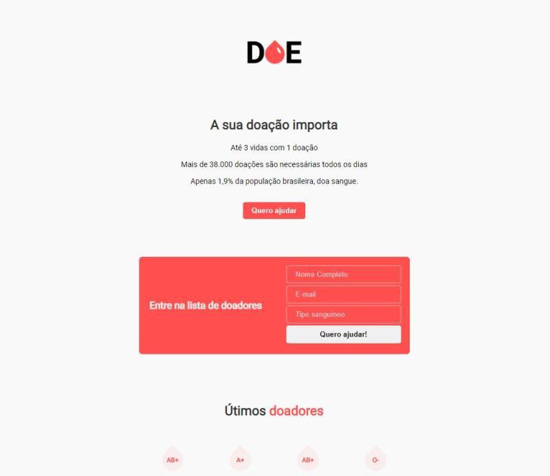

# <h3 align="center">DOE</h3>

   FULLSTACK PROJECT
     
    
    
 ## Build with
* [HTML]()
* [CSS]()
* [JAVASCRIPT]()
* [NODE]()
* [POSTGRESQL]()

## Usage
Basic Fullstack Project, based in html, css and js. A website to blood donation. 
## Architecture:
* Header
* Home
* Subscribe card
* Last donors
* Footer

## Getting Started

git clone https://github.com/SthefanneBatista/MaratonaDev/
